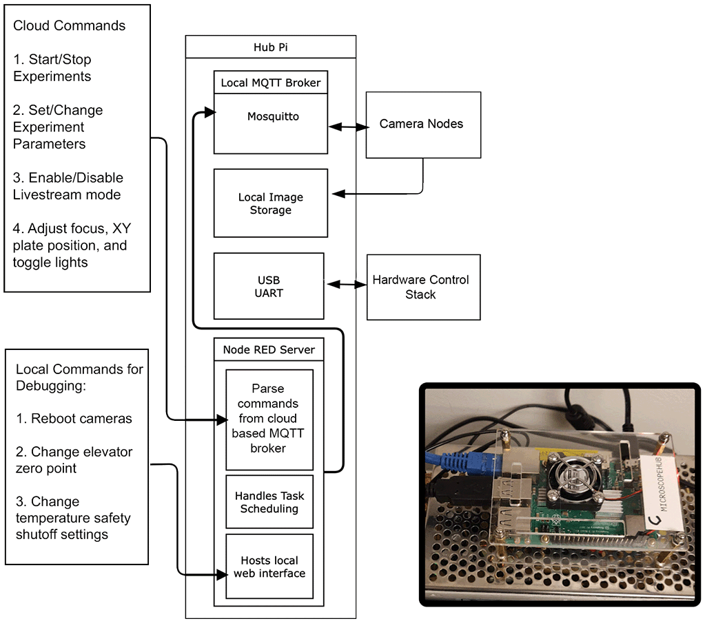
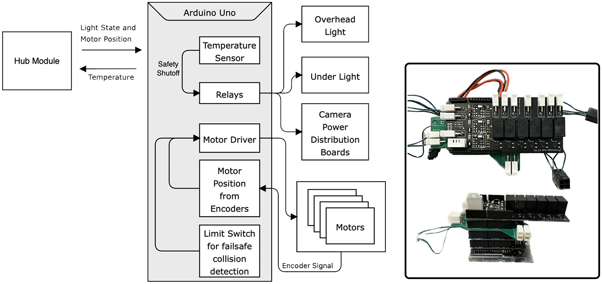

# openCArM: open-source camera array microscopy for biology

## Camera Module

 
## Hub Module

## Motor, Lights, and Sensing Module

## Installation
Hub Module can be installed with docker on raspberry pi. Need to set up appropriate .env file to point to MQTT broker and S3 Object storage.

### TODO
- [ ] make s3 endpoint configurable
- [ ] full installation instructions
- [ ] reference other related repos needed for complete working system
- [ ] paper references